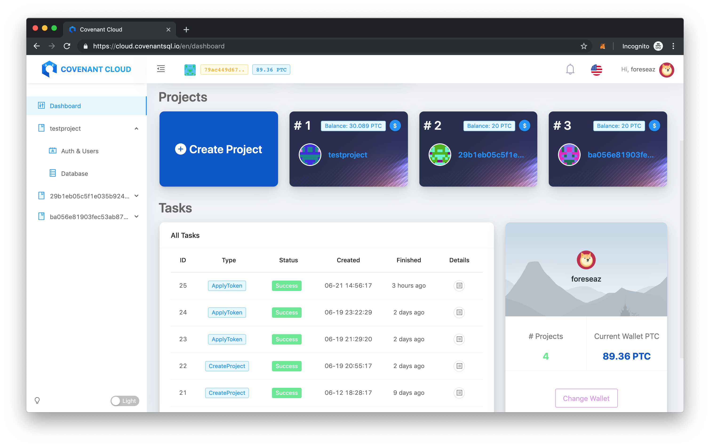

<p align="center">
  <a href="http://github.com/CovenantSQL/cql-cloud-fe">
    
  </a>
</p>

<h1 align="center">CovenantSQL Cloud Portal</h1>

<div align="center">

CovenantSQL Cloud front-end portal, wallet managements, PTC faucet, database managements and more.

[](http://commitizen.github.io/cz-cli/)
[](https://github.com/ant-design/ant-design)
[](https://github.com/umijs/umi)
[](http://opensource.org/licenses/MIT)
[](https://github.com/CovenantSQL/cql-cloud-fe/pulls)
[](https://gitter.im/CovenantSQL/CovenantSQL?utm_source=badge&utm_medium=badge&utm_campaign=pr-badge&utm_content=badge)
[](https://app.netlify.com/sites/cql-cloud/deploys)



</div>

## Features

- Create, downlaod, upload CovenantSQL wallets, get PTC from faucet
- Create project and database, top-up projects
- One-click OAuth integration in projects
- Create tables and add fields to database, set table rules
- CLQ cloud database empower your SPA into a full dynamic App

## Usage

1. Clone project code.

```bash
git clone https://github.com/CovenantSQL/cql-cloud-fe.git my-project
cd my-project
```

2. Installation dependence.

```bash
yarn install
```

Or

```bash
npm install
```

3. Start local server.

```bash
npm run start
```

4. After the startup is complete, open a browser and visit [http://localhost:7000](http://localhost:7000), If you need to change the startup port, you can configure it in the `.env` file.


> [documentation]() is working in progress


## Browsers support

Modern browsers.

| [](http://godban.github.io/browsers-support-badges/)</br>IE / Edge | [](http://godban.github.io/browsers-support-badges/)</br>Firefox | [](http://godban.github.io/browsers-support-badges/)</br>Chrome | [](http://godban.github.io/browsers-support-badges/)</br>Safari | [](http://godban.github.io/browsers-support-badges/)</br>Opera |
| --------- | --------- | --------- | --------- | --------- |
|IE11, Edge| last 2 versions| last 2 versions| last 2 versions| last 2 versions

## Credits

CovenantSQL Cloud Portal is developed on top of [antd-admin](https://github.com/zuiidea/antd-admin), integrated with a lot of great open-source projects including:

- [commitizen](https://github.com/commitizen/cz-cli)
- [Ant Design Pro](https://github.com/ant-design/ant-design-pro)
- ...

<div align="center">
   <a href="https://www.netlify.com">
    
  </a>
</div>
